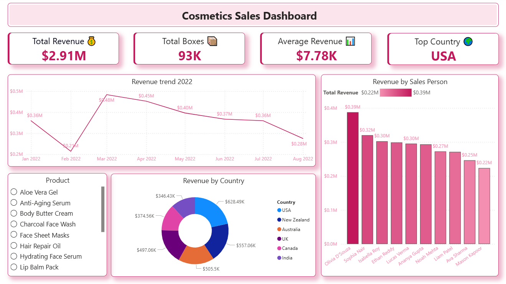

# 💄 Cosmetics Sales Dashboard – Power BI 2022

## 📌 Project Overview
An interactive Power BI dashboard analyzing cosmetics sales performance 
across multiple dimensions: revenue trends, product performance, 
country-level distribution, and individual salesperson KPIs.

## 📊 Dashboard Pages

### 1. Executive Summary

- **Total Revenue:** $2.91M | **Total Boxes Sold:** 93K
- **Average Revenue:** $7.78K | **Top Country:** USA
- Monthly revenue trend (Jan–Aug 2022)
- Revenue breakdown by country (USA leads at $628K)
- Sales performance comparison across 10 reps

### 2. Product Analysis

- **Top Product:** Tea Tree Moisturizer ($260.91K)
- **15 products** analyzed with revenue ranking
- Visual treemap and bar chart comparisons
- Filter by individual salesperson

### 3. Salesperson Performance

- **Top Performer:** Olivia D'Souza ($387.41K)
- **Avg Revenue per Person:** $290.91K
- Geographic sales mapping
- Detailed table with revenue, boxes, and avg metrics

## 🛠️ Tools Used
- **Power BI Desktop** – Data modeling & visualization
- **Microsoft Excel** – Raw data source
- **DAX** – Calculated measures and KPIs

## 💡 Key Insights
- Revenue peaked in **March 2022** ($0.48M) then declined through August
- **USA dominates** with $628K (21.6% of total revenue)
- **Tea Tree Moisturizer** is the best-selling product
- **Olivia D'Souza** outperforms the team average by 33%

## 📁 Files
| File | Description |
|------|-------------|
| `cosmetics_dashboard.pbix` | Main Power BI file |
| `images/` | Dashboard screenshots |
| `data/` | Source data (Excel) |
